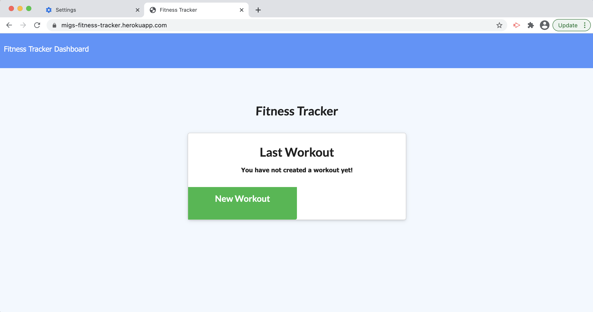

# Workout Tracker

## User Story

* You want to be able to view create and track daily workouts? You want to be able to log multiple exercises in a workout on a given day? With this App, you should be able to track the name, type, weight, sets, reps, and duration of exercise. If the exercise is a cardio exercise, you will be able to track my distance traveled.

 
https://migs-fitness-tracker.herokuapp.com
 
 
 

